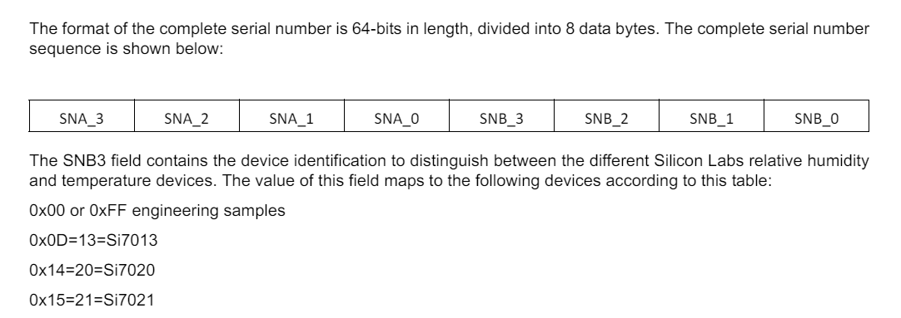

I recently took a break from work to welcome our beautiful baby boy into the world. During this time I found it a good fit to pick up some of the projects I've been wanting to bulid. I've had an itch to improve the home weather station I built a few years ago, and I've also been dreaming up a custom smart thermostat that works well with Home Assistant. I'll need a  temperature and humidity sensor for both of those projects so I wanted wanted to try out a few different temperature and humidity sensors to see which one I liked best. 

With all the buzz around ChatGPT, I thought it would be interesting to see if it could help with some of the work writing a driver to communicate with the Si7021 temperature and humidity sensor using I2c. 

### Creating a header file

I started with some basic instructions on some specifics around what I was looking for, and included the datasheet for the sensor I was planning to use.


The resulting generated code

```c++
#ifndef SI7021_H
#define SI7021_H

#include <Wire.h>  // Include the Wire library for I2C communication

#define SI7021_ADDRESS 0x40  // I2C address of the Si7021 sensor

// Command definitions for the Si7021 sensor
#define MEASURE_REL_HUMIDITY_HOLD_MASTER_MODE   0xE5
#define MEASURE_REL_HUMIDITY_NO_HOLD_MASTER_MODE 0xF5
#define MEASURE_TEMPERATURE_HOLD_MASTER_MODE    0xE3
#define MEASURE_TEMPERATURE_NO_HOLD_MASTER_MODE 0xF3
#define READ_TEMPERATURE_FROM_PREVIOUS_RH_MEASUREMENT 0xE0
#define RESET_COMMAND                           0xFE
#define WRITE_RH_T_USER_REGISTER_1              0xE6
#define READ_RH_T_USER_REGISTER_1               0xE7
#define WRITE_HEATER_CONTROL_REGISTER           0x51
#define READ_HEATER_CONTROL_REGISTER            0x11
#define READ_ELECTRONIC_ID_1ST_BYTE             0xFA0F
#define READ_ELECTRONIC_ID_2ND_BYTE             0xFCC9
#define READ_FIRMWARE_REVISION                  0x84B8

class Si7021 {
public:
    // Constructor
    Si7021();

    // Function to initialize the I2C communication
    void begin();
};

#endif // SI7021_H

```

And the command table from the datasheet


At first look this looks like a reasonable starting point. It looks like the code is assuming that I'll be using the Arduino wire library. No big deal, I didn't specify a specific way to communicate over I2C, and there is probably other code out there using the Si7021 with Arduino. One thing that does seem off is how the commands are defined for reading the electronic ID, and the firmware revision.

```c++
...

#define READ_ELECTRONIC_ID_1ST_BYTE             0xFA0F
#define READ_ELECTRONIC_ID_2ND_BYTE             0xFCC9
#define READ_FIRMWARE_REVISION                  0x84B8

...
```

The datasheet specifies that to read the electronic ID of the sensor, two bytes should be written to the Si7021, then 8 bytes should be read from the sensor. This is the first half of the ID. Another 2 bytes should be written to the sensor, and then read another 6 bytes. This is the second half of the ID. 


The firmware revision command is similar, where 2 bytes are written, but then a single byte is read which is the revision number. 

ChatGPT has defined these commands as 16 bit integers, and called them 1st and 2nd byte. I suppose it would be possible to use the commands as they are, but the names are certianly confusing, and I think it could be more clear if we split these commands up into each byte we need to write. Let's see if we can prompt ChatGPT to make this update. 


```c++
...

// Two-byte commands
#define READ_ELECTRONIC_ID_1ST_BYTE_MSB         0xFA
#define READ_ELECTRONIC_ID_1ST_BYTE_LSB         0x0F
#define READ_ELECTRONIC_ID_2ND_BYTE_MSB         0xFC
#define READ_ELECTRONIC_ID_2ND_BYTE_LSB         0xC9
#define READ_FIRMWARE_REVISION_MSB              0x84
#define READ_FIRMWARE_REVISION_LSB              0xB8

...
```

Okay, not too bad, the values appear to be correct, but the naming is still really bad. Let's just fix the names the old fashion way, and we can move on.

```c++
...

// Two-byte commands
#define READ_ELECTRONIC_ID_ONE          0xFA
#define READ_ELECTRONIC_ID_TWO          0x0F
#define READ_ELECTRONIC_ID_THREE        0xFC
#define READ_ELECTRONIC_ID_FOUR         0xC9
#define READ_FIRMWARE_REVISION_ONE      0x84
#define READ_FIRMWARE_REVISION_TWO      0xB8

...
```

Perfect names eh? Maybe not but they'll do for now. 

This feels like a pretty good start defining the commands. Let's move on to defining some of the basics to communicate with the sensor over I2C.
I plan to to use the Raspberry Pi Pico for my projects, using the C/C++ Pico SDK but I would like to create a generic class that can be used with other platforms, like maybe the ESP32 using the ESP-IDF in the future. 

### Class Definition

I think it makes sense to start with an initialization method that when implemented will initalize the I2C bus.


```c++
class Si7021 {
public:
    // Constructor
    Si7021();

    // Function to initialize the I2C communication
    void begin();

    // Function to initialize the Si7021 sensor
    int init();

private:
    // Private helper function to send a reset command
    void reset();
};
```

Yep, looks like an init method. We did also get a private reset method that we didn't ask for, but maybe we'll use it. I'll leave it for now. 
One thing I don't love is the init method just returns an integer, that isn't defined anywhere else AKA a magic number. I'd rather use an enumeration that define the different possibe error states of the Si7021. 


```c++
...
// Enumeration for error states
enum Si7021_ErrorCode {
    SI7021_OK = 0,
    SI7021_ERR_I2C_INIT,
    SI7021_ERR_NO_RESPONSE,
    SI7021_ERR_INVALID_CHIP_ID,
    SI7021_ERR_UNKNOWN
};

...

// Function to initialize the Si7021 sensor
Si7021_ErrorCode init();
...

```

Okay, this will do. Let's get the other methods we'll need for the basic features of the sensor. 


```c++
...
public:
    ...
    // Function to read humidity
    float readHumidity();

    // Function to read temperature
    float readTemperature();

private:
  
    // Private helper function to write to the I2C bus
    void writeI2C(uint8_t command);

    // Private helper function to read from the I2C bus
    uint16_t readI2C();

...
```

Maybe this could work, but I think it makes more sense to have all these methods return the error code. For the readHumidity and readTemperature methods, we'll need a pointer that will be used to store the result of the read. For the I2C methods we'll need to pass in a buffer for the data to read or write, and the length to read or write.


```c++
...
    // Function to read humidity
    Si7021_ErrorCode readHumidity(float &humidity);

    // Function to read temperature
    Si7021_ErrorCode readTemperature(float &temperature); 
...
```


```c++
...
  // Private helper function to write to the I2C bus
    Si7021_ErrorCode writeI2C(uint8_t *buffer, size_t length);

    // Private helper function to read from the I2C bus
    Si7021_ErrorCode readI2C(uint8_t *buffer, size_t length);
...
```

Not too bad. This should do for the basics of our class. We can move on to implementing the methods. 

### Implementing the Class methods


```c++
#include "Si7021.h"

// Constructor
Si7021::Si7021() {
    // Constructor body, if any initialization is needed
}

// Function to initialize the I2C communication
void Si7021::begin() {
    Wire.begin();  // Initialize the I2C communication
}

// Function to initialize the Si7021 sensor
Si7021_ErrorCode Si7021::init() {
    // Send a reset command to the sensor
    reset();

    // Wait for the sensor to reset
    delay(50);

    // Read the electronic ID to verify communication
    uint8_t idBuffer[8];
    writeI2C(new uint8_t[2]{READ_ELECTRONIC_ID_1ST_BYTE_MSB, READ_ELECTRONIC_ID_1ST_BYTE_LSB}, 2);
    Si7021_ErrorCode errorCode = readI2C(idBuffer, 8);
    if (errorCode != SI7021_OK) {
        return errorCode;
    }

    // Check the sensor ID
    if (idBuffer[0] != 0x00 && idBuffer[0] != 0xFF && idBuffer[0] != 0x15) {
        return SI7021_ERR_INVALID_CHIP_ID;
    }

    return SI7021_OK;
}

// Private helper function to send a reset command
void Si7021::reset() {
    uint8_t resetCmd = RESET_COMMAND;
    writeI2C(&resetCmd, 1);
}

// Private helper function to write to the I2C bus
Si7021_ErrorCode Si7021::writeI2C(uint8_t *buffer, size_t length) {
    Wire.beginTransmission(SI7021_ADDRESS);
    Wire.write(buffer, length);
    if (Wire.endTransmission() != 0) {
        return SI7021_ERR_WRITE;
    }
    return SI7021_OK;
}

// Private helper function to read from the I2C bus
Si7021_ErrorCode Si7021::readI2C(uint8_t *buffer, size_t length) {
    Wire.requestFrom(SI7021_ADDRESS, length);
    if (Wire.available() < length) {
        return SI7021_ERR_READ;
    }
    for (size_t i = 0; i < length; i++) {
        buffer[i] = Wire.read();
    }
    return SI7021_OK;
}
```

Okay, well that was a lot of code all in one go. Let's start by reviewing the init method.

```c++
Si7021_ErrorCode Si7021::init() {
    // Send a reset command to the sensor
    reset();

    // Wait for the sensor to reset
    delay(50);

    // Read the electronic ID to verify communication
    uint8_t idBuffer[8];
    writeI2C(new uint8_t[2]{READ_ELECTRONIC_ID_1ST_BYTE_MSB, READ_ELECTRONIC_ID_1ST_BYTE_LSB}, 2);
    Si7021_ErrorCode errorCode = readI2C(idBuffer, 8);
    if (errorCode != SI7021_OK) {
        return errorCode;
    }

    // Check the sensor ID
    if (idBuffer[0] != 0x00 && idBuffer[0] != 0xFF && idBuffer[0] != 0x15) {
        return SI7021_ERR_INVALID_CHIP_ID;
    }

    return SI7021_OK;
}
```

First off, it also looks like this code is still targeting an Arduino platform, so we'll need to try again, but let's review what we have first. The code calls the reset method to get the sensor into a good state. Sure, that doesn't seem too far off from what we'd need. Next a delay, with a hard coded 50ms. I'm not sure what this is about, but maybe the datasheet specifies some startup time, before the sensor is ready to communicate. I'll take a look at the datasheet and come back to this later. 

Next the code is reading the electronic ID of the sensor. I didn't ask for this, but I also didn't really specify much about what we did want to happen when the sensor is initialized. This code does appear to be correct to read the first half of the electronic ID, but it is not very consistent. The buffer to read the data is statically allocated, but the buffer to write the command is dynamically allocated using the "new" keyword. I didn't specify a preference, but it doesn't really make sense to use both. Another thing that seems odd is the code to check the sensor ID. The code is checking to see if the first byte is either 0, 255 (or maybe -1), or 21. I'll need to read through the datasheet to see if there is any reason here, but this code is certainly not great for readiblity. It uses magic numbers that make it difficult to understand what is happening.

### Trying Again

Let's try again, specifying that we want to use the Pico SDK for this driver, and see if we can get something closer to what we need.


Si7021.h
```c++
#ifndef SI7021_H
#define SI7021_H

#include "hardware/i2c.h"

// I2C address of the Si7021 sensor
#define SI7021_ADDRESS 0x40  

... // Commands

... // Error codes

class Si7021 {
public:
    // Constructor
    Si7021(i2c_inst_t *i2c, uint sda_pin, uint scl_pin);

    // Function to initialize the I2C communication
    Si7021_ErrorCode init();

private:
    i2c_inst_t *i2c_;
    uint sda_pin_;
    uint scl_pin_;

    // Private helper function to send a reset command
    void reset();
};

#endif // SI7021_H

```

Si7021.cpp
```c++
#include "Si7021.h"
#include "pico/stdlib.h"

// Constructor
Si7021::Si7021(i2c_inst_t *i2c, uint sda_pin, uint scl_pin) : i2c_(i2c), sda_pin_(sda_pin), scl_pin_(scl_pin) {}

// Function to initialize the Si7021 sensor
Si7021_ErrorCode Si7021::init() {
    // Initialize the I2C communication
    i2c_init(i2c_, 100 * 1000);  // Initialize I2C at 100 kHz
    gpio_set_function(sda_pin_, GPIO_FUNC_I2C);
    gpio_set_function(scl_pin_, GPIO_FUNC_I2C);
    gpio_pull_up(sda_pin_);
    gpio_pull_up(scl_pin_);

    // Send a reset command to the sensor
    reset();

    // Wait for the sensor to reset
    sleep_ms(50);

    // Read the electronic ID to verify communication
    uint8_t write_buffer[2] = {READ_ELECTRONIC_ID_1ST_BYTE_MSB, READ_ELECTRONIC_ID_1ST_BYTE_LSB};
    uint8_t read_buffer[8];
    i2c_write_blocking(i2c_, SI7021_ADDRESS, write_buffer, 2, true);
    int read_res = i2c_read_blocking(i2c_, SI7021_ADDRESS, read_buffer, 8, false);
    if (read_res == PICO_ERROR_GENERIC) {
        return SI7021_ERR_NO_RESPONSE;
    }

    // Check the sensor ID
    if (read_buffer[0] != 0x00 && read_buffer[0] != 0xFF && read_buffer[0] != 0x15) {
        return SI7021_ERR_INVALID_CHIP_ID;
    }

    return SI7021_OK;
}

// Private helper function to send a reset command
void Si7021::reset() {
    uint8_t reset_cmd = RESET_COMMAND;
    i2c_write_blocking(i2c_, SI7021_ADDRESS, &reset_cmd, 1, false);
}

```

Well, unfortunately we lost our temperature, humidity, and I2c read and write methods in our class. Fair enough, we did ask specifically to only generate the init method. In better news, the code does now look like it is targeting the Pico SDK. The constructor is now taking in some parameters like thie I2c instance, and the pins numbers to use for the SDA and SCL pins. This will make the code more flexible, and I think is a good addition, but it does create a driver that is very specific to work with only the Pico SDK. The init method is now using the Pico SDK funtions to initalize the I2c bus, which is great. The code is also now statically allocating both the read and write buffer, which is also great to see. Again the code to read the electronic ID looks correct, but the check for the the ID seems odd, and the magic numbers are still present.

Maybe it's worth asking ChatGPT to explan what the code to verify the sensor ID is doing. 


Okay, so these values are some expected valid values, and after reading through the datasheet, I found that there is a list a valid values for the first byte of the electronic ID. 



We'll ask to modify the code to make it more readable


```c++
...
// Special values for sensor ID checking
#define SI7021_ID_SAMPLE_1                      0x00
#define SI7021_ID_SAMPLE_2                      0xFF
#define SI7021_ID_SI7021                        0x15
...
```

Looks great. This is a good stopping point for now. It's not a fully working driver, and we're not even able to read the temperature or humidity yet, but we have a good start, and we should be able to compile this code, and run it on the Raspberry Pi Pico, to ensure we can communicate with the Si7021. Here is the final code generated by ChatGPT.

### Final Code

Si7021.h
```c++
#ifndef SI7021_H
#define SI7021_H

#include "hardware/i2c.h"

// I2C address of the Si7021 sensor
#define SI7021_ADDRESS 0x40  

// Command definitions for the Si7021 sensor
#define MEASURE_REL_HUMIDITY_HOLD_MASTER_MODE   0xE5
#define MEASURE_REL_HUMIDITY_NO_HOLD_MASTER_MODE 0xF5
#define MEASURE_TEMPERATURE_HOLD_MASTER_MODE    0xE3
#define MEASURE_TEMPERATURE_NO_HOLD_MASTER_MODE 0xF3
#define READ_TEMPERATURE_FROM_PREVIOUS_RH_MEASUREMENT 0xE0
#define RESET_COMMAND                           0xFE
#define WRITE_RH_T_USER_REGISTER_1              0xE6
#define READ_RH_T_USER_REGISTER_1               0xE7
#define WRITE_HEATER_CONTROL_REGISTER           0x51
#define READ_HEATER_CONTROL_REGISTER            0x11

// Two-byte commands
#define READ_ELECTRONIC_ID_1ST_BYTE_MSB         0xFA
#define READ_ELECTRONIC_ID_1ST_BYTE_LSB         0x0F
#define READ_ELECTRONIC_ID_2ND_BYTE_MSB         0xFC
#define READ_ELECTRONIC_ID_2ND_BYTE_LSB         0xC9
#define READ_FIRMWARE_REVISION_MSB              0x84
#define READ_FIRMWARE_REVISION_LSB              0xB8

// Special values for sensor ID checking
#define SI7021_ID_SAMPLE_1                      0x00
#define SI7021_ID_SAMPLE_2                      0xFF
#define SI7021_ID_SI7021                        0x15

// Enumeration for error states
enum Si7021_ErrorCode {
    SI7021_OK = 0,
    SI7021_ERR_I2C_INIT,
    SI7021_ERR_NO_RESPONSE,
    SI7021_ERR_INVALID_CHIP_ID,
    SI7021_ERR_WRITE,
    SI7021_ERR_READ,
    SI7021_ERR_UNKNOWN
};

class Si7021 {
public:
    // Constructor
    Si7021(i2c_inst_t *i2c, uint sda_pin, uint scl_pin);

    // Function to initialize the I2C communication
    Si7021_ErrorCode init();

private:
    i2c_inst_t *i2c_;
    uint sda_pin_;
    uint scl_pin_;

    // Private helper function to send a reset command
    void reset();
};

#endif // SI7021_H
```

Si7021.cpp
```c++
#include "Si7021.h"
#include "pico/stdlib.h"

// Constructor
Si7021::Si7021(i2c_inst_t *i2c, uint sda_pin, uint scl_pin) : i2c_(i2c), sda_pin_(sda_pin), scl_pin_(scl_pin) {}

// Function to initialize the Si7021 sensor
Si7021_ErrorCode Si7021::init() {
    // Initialize the I2C communication
    i2c_init(i2c_, 100 * 1000);  // Initialize I2C at 100 kHz
    gpio_set_function(sda_pin_, GPIO_FUNC_I2C);
    gpio_set_function(scl_pin_, GPIO_FUNC_I2C);
    gpio_pull_up(sda_pin_);
    gpio_pull_up(scl_pin_);

    // Send a reset command to the sensor
    reset();

    // Wait for the sensor to reset
    sleep_ms(50);

    // Read the electronic ID to verify communication
    uint8_t write_buffer[2] = {READ_ELECTRONIC_ID_1ST_BYTE_MSB, READ_ELECTRONIC_ID_1ST_BYTE_LSB};
    uint8_t read_buffer[8];
    i2c_write_blocking(i2c_, SI7021_ADDRESS, write_buffer, 2, true);
    int read_res = i2c_read_blocking(i2c_, SI7021_ADDRESS, read_buffer, 8, false);
    if (read_res == PICO_ERROR_GENERIC) {
        return SI7021_ERR_NO_RESPONSE;
    }

    // Check the sensor ID
    if (read_buffer[0] != SI7021_ID_SAMPLE_1 && read_buffer[0] != SI7021_ID_SAMPLE_2 && read_buffer[0] != SI7021_ID_SI7021) {
        return SI7021_ERR_INVALID_CHIP_ID;
    }

    return SI7021_OK;
}

// Private helper function to send a reset command
void Si7021::reset() {
    uint8_t reset_cmd = RESET_COMMAND;
    i2c_write_blocking(i2c_, SI7021_ADDRESS, &reset_cmd, 1, false);
}
```

### Does it compile and run?

I created a simple main.cpp file, that calls the constructor of the Si7021 class, and then calls the init method. 

```c++
#include <stdio.h>
#include "pico/stdlib.h"
#include "Si7021.h"
#include "hardware/i2c.h"

#define SDA_PIN 20
#define SCL_PIN 21

int main() {
    stdio_init_all();

    Si7021 sensor(i2c_default, SDA_PIN, SCL_PIN);

    Si7021_ErrorCode err = sensor.init();

    printf("Si7021 init error code: %d\n", err);

    while (true) {
        tight_loop_contents();
    }


}
```

and a simple cmake file to build the project

```cmake
cmake_minimum_required(VERSION 3.12)

# Pull in SDK (must be before project)
include(pico_sdk_import.cmake)


project(pico_examples C CXX ASM)
set(CMAKE_C_STANDARD 11)
set(CMAKE_CXX_STANDARD 17)

if (PICO_SDK_VERSION_STRING VERSION_LESS "1.3.0")
    message(FATAL_ERROR "Raspberry Pi Pico SDK version 1.3.0 (or later) required. Your version is ${PICO_SDK_VERSION_STRING}")
endif()


# Initialize the SDK
pico_sdk_init()


add_executable(si7021
    main.cpp
    Si7021.cpp
)

# Specify that the library includes header files from the current directory
target_include_directories(si7021 PUBLIC ${CMAKE_CURRENT_SOURCE_DIR}/include)

target_link_libraries(si7021 
    pico_stdlib
    hardware_i2c
)

```

The code compiled without any issues, and I was able to flash the code to the Raspberry Pi Pico. I connected the SDA and SCL pins to the Si7021 sensor, and powered up the Pico. Oddly the code seems to be reading the wrong information from the chip, as the first byte read is 0x1A, which is not one of the expected values. I'll need to take a closer look at the code, the wiring, and the datasheet to see what is going wrong. 


### Summary

So I did eventually get code that compiles and runs, and communicates with the Si7021 sensor. So will I continue to use ChatGPT for all my software develpment endoevors. Well it depends. ChatGPT was great for quickly digging through the datasheet, and I've found that it helped me find the specific details that I need quickly. It also did a pretty good job extracting the commands in the table from the datasheet, and creating the definitions for the commands in the headerfile. What I didn't like about using ChatGPT is that it generated a LOT of code with every prompt, even when I asked for only small chinks at a time. The quality of the code was pretty inconsistent, and it feels a bit like a collection of example code all pasted together. It still took a lot of work to review each line of code, and many times there were subtle problems in the code, that could be hard to catch. The code that was generated didn't take into account error handling, which obviously wouldn't make the cut as production code, and the code was also structured in a way that would make it difficult to test. Maybe the code could have been better if I was more explicit about exactly what I wanted in each prompt, but it seems like there are diminishing returns, as then really it's only saving me the time it takes to type out the code. I certainly am going to keep ChatGPT close at hand in my workflow software develpment, but I don't think it's really practical as a replacement for writing well structured, and testable code. 

